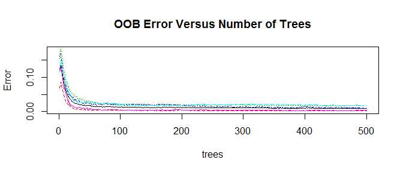
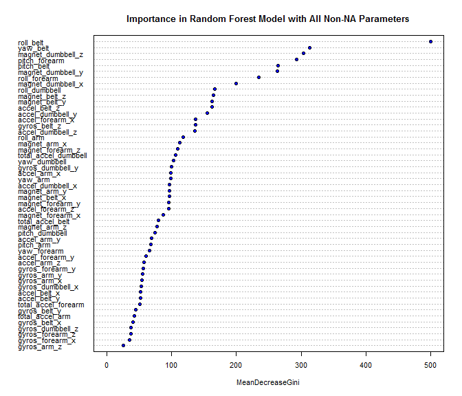

# Practical Machine Learning Course Project
Alexander Carlton  
March 31, 2016  


## Executive Summary

This project seeks to make a predictive model from a dataset
that is part of the Human Activity Recognition project.
A model was built in R, based on the 'randomForest' package.
Variations of this model (input preprocessing, feature reduction)
were tested.
A final model was produced using only 6 of the almost 160
features that still achieves about a 97% accuracy rate.


## Introduction

This project seeks to make a predictive model from a dataset
that is part of the Human Activity Recognition project.
The goal is to see if the model can correctly identify
the class of execution (which form of barbell lift)
from a single weight lifting experiment performed
by several participants.

This project looks at the Weight Lifting Exercises Dataset
from the Human Activity Recognition project:  
* Velloso, E.; Bulling, A.; Gellersen, H.; Ugulino, W.; Fuks, H.  
* Qualitative Activity Recognition of Weight Lifting Exercises.  
* Proceedings of 4th International Conference 
in Cooperation with SIGCHI (Augmented Human '13).
Stuttgart, Germany: ACM SIGCHI, 2013.  
* http://groupware.les.inf.puc-rio.br/har  

## Exploratory Analyses

### Fetch and Load

For the purposes of this project a class-specific version of
the data set was used.


```r
url_train <- 'https://d396qusza40orc.cloudfront.net/predmachlearn/pml-training.csv'
url_check <- 'https://d396qusza40orc.cloudfront.net/predmachlearn/pml-testing.csv'
filename_train <- 'pml-training.csv'
filename_test  <- 'pml-testing.csv'
if (!file.exists(filename_train)) {
    download.file(url_train, filename_train)
}
if (!file.exists(filename_test)) {
    download.file(url_check, filename_test)
}
```

A quick review of the raw data shows that there are a large
number of empty entries (no value at all), there are
a reasonable number of entries marked 'NA', and there
are also a number of entries whose value is '#DIV/0!'
(similar to how Microsoft Excel reports a math error).
For the purposes of this report we classified all three
cases as NA values, which does allow a simple 'read.csv()'
call to bring in all of these columns as numeric
(non-numeric values in a column, such as the '#DIV/0!'
values would force read.csv() to treat the column as
factors or characters.)


```r
pml_na_strings = c(
    '',               # Many values are empty -- might as well be NAs
    'NA',             # Many values are already marked NA -- keep as NA
    '#DIV/0!'         # A few look like some Excel-style calculation failure
)
pml_train <- read.csv(filename_train, na.strings = pml_na_strings)
pml_test  <- read.csv(filename_test,  na.strings = pml_na_strings)
data.frame(           # Table of dimensions of loaded datasets
    file = c(filename_train, filename_test),
    rows = c(nrow(pml_train), nrow(pml_test)),
    cols = c(ncol(pml_train), ncol(pml_test))
)
```

```
##               file  rows cols
## 1 pml-training.csv 19622  160
## 2  pml-testing.csv    20  160
```


### Data Preparation


#### Dropping Empty and Non-Sensor Columns

Several of the leading columns appear to be mostly
about experimental bookkeeping (time of day, participant,
measurement mechanics, et al).  To allow the models to
focus on the sensor-derived values, these columns are
dropped from the dataset before model fitting is attempted.

There are a lot of NA values in the raw data, some columns
have nothing but NA values.
On the assumption that it is counterproductive to attempt to
build models on NA values, the first challenge is to establish
an effective manner for dealing with these NAs.
The approach taken was to divide the provided data into two
datasets, 
a 'wide' dataset based on the rows where 'new_window == yes'
which are the only a few rows with NA values,
and the other a 'tall' dataset (those columns that
did not turn into NA values when 'new_window != yes').


```r
win_is_new <- pml_train$new_window == 'yes'              # find new-win rows
data_keep <- pml_train[,8:160]                           # drop bookkeeping cols

data_wide <- data_keep[win_is_new,]                      # keep new-win rows
data_wide <- data_wide[,colMeans(is.na(data_wide)) < 1]  # drop cols w/ all NAs

data_tall <- data_keep[,colMeans(is.na(data_keep)) == 0] # drop cols w/ any NAs

data.frame(
    dataset = c('pml_train', 'data_keep', 'data_wide', 'data_tall'),
    rows = c(nrow(pml_train), nrow(data_keep), nrow(data_wide), nrow(data_tall)),
    cols = c(ncol(pml_train), ncol(data_keep), ncol(data_wide), ncol(data_tall)),
    fractionNA = c(
        sum(colSums(is.na(pml_train))) / (nrow(pml_train)*ncol(pml_train)),
        sum(colSums(is.na(data_keep))) / (nrow(data_keep)*ncol(data_keep)),
        sum(colSums(is.na(data_wide))) / (nrow(data_wide)*ncol(data_wide)),
        sum(colSums(is.na(data_tall))) / (nrow(data_tall)*ncol(data_tall))
    )
)
```

```
##     dataset  rows cols fractionNA
## 1 pml_train 19622  160 0.61318354
## 2 data_keep 19622  153 0.64123769
## 3 data_wide   406  147 0.01786133
## 4 data_tall 19622   53 0.00000000
```

The 'wide' dataset appears to offer a less attractive basis
for modeling (a limited count of observations, and
still have a few NAs [from the '#DIV/0!' values],
also the probably well over 100 columns are more than is needed.
A separate analysis of the wide dataset suggested that
going 'wide' did not offer any predictive advantage over going 'tall'.

For this report, the model analysis focused on the 'tall'
dataset, which provided many thousands of observations
over more than 50 columns of variables -- with this many
observations, we can afford to be generous in building
separate datasets for different stages of model development.


### Separation of Training and Other Datasets

For the future analysis we separated the remaining data
into a 'train' and 'check' (first level testing) sets,
and both are separate from a 'probe' dataset that can
be used for final model predictions (fully independent
from the data used to develop the model).


```r
suppressPackageStartupMessages(library(caret))

set.seed(20160331)        # Pick a seed, any seed, but set _some_ seed...
ycol <- ncol(data_tall)   # the response is in the last column of the dataset

# Separate training data, and hold out a separate dataset for the final model
holdOut <- createDataPartition(y = data_tall[,ycol], p = 0.3, list = FALSE)
trainy <- data_tall[-holdOut, ycol        ]
trainx <- data_tall[-holdOut, 1:(ycol - 1)]
probey <- data_tall[ holdOut, ycol        ]
probex <- data_tall[ holdOut, 1:(ycol - 1)]

# Break training data into a training and a check dataset (for cross-validation)
inTrain <- createDataPartition(y = trainy, p = 4/7, list = FALSE)
checky <- trainy[-inTrain]
checkx <- trainx[-inTrain,]
trainy <- trainy[ inTrain]
trainx <- trainx[ inTrain,]

data.frame(
    set = c('trainx', 'checkx', 'probex'),
    rows = c(nrow(trainx), nrow(checkx), nrow(probex))
)
```

```
##      set rows
## 1 trainx 7850
## 2 checkx 5883
## 3 probex 5889
```


## Model Building

This project is basically an exercise in classification.
The response variable is one of five class values
(simplistically labeled as 'A' through 'E'), 
where 'A' represents the weight lifting being
executed according to specification,
and each of the other classes representing an attempt
by the participant to exhibit a specific improper method
of execution.

This kind of situation fits a tree-based approach well.
It seems likely that the key to
this exercise is to see if there are specific readings
in the sensor values that can be used to identify each
of the modes of behavior.
Without a need to understand or predict how all the values
work together, the decision trees can be setup to seek
where there may be specific differences in a few select
values that can be used to reveal each class of execution.

Simplistic experiments with the `caret` package showed
that right out of the box that `method = 'rf'` produced
lower OOB error values than for the bagging or boosting
methods.  Hence the rest of the work focused on seeing
what could be accomplished with the `randomForest` library.


### Random Forest

To begin the model analysis we started with the most
basic call to `randomForest` possible, model the response
against all available parameters, and rely on the default
values for everything else.


```r
suppressPackageStartupMessages(library(randomForest))
fit_rf <- randomForest(trainx, trainy)
yhat_rf <- predict(fit_rf, newdata = checkx)
miss_rf <- mean(yhat_rf != checky)
round(miss_rf, 3)
```

```
## [1] 0.01
```

With just the most naive use of `randomForest()` we still
achieved a miss-classification rate of ~1%.

The issue then is not so much how well we can predict
within the provided 'train' dataset, but rather how
well we can predict with out-of-sample data and how
much can we simplify the model without sacrificing
very much of this prediction strength.

Right from the most naive model there is one thing that
we can learn, that the default number of trees, 500, is
much larger than we need.  Looking at a simple plot of the
model, 50 trees seem enough, and 100 is well into the flat
part of the curve.
Use of a smaller value for 'ntree' helps keep a lid on
the computation requirements (memory and time), 
which is a benefit given
that we are working with more than 10,000 observations.


```r
plot(fit_rf, main = 'OOB Error Versus Number of Trees')
```

<!-- -->

```r
ntree = 50    # Set a value of ntree for the rest of the work
```

Note: `randomForest()` uses internally and does report an
'OOB estimate of error rate` when the model is printed,
and that value can be a useful indicator of relative success,
but this report prefers to calculate our own mis-prediction
rates so that we can work cross-validation explicitly and
perhaps learn more about how the models behave in the process.

The internal OOB estimate does track with the results from
matching cross-validation testing, and in cases where the
number of observations are limited not needing yet another
partition of the dataset for cross-validation could be a very
important advantage for Random Forests.  However for this report,
while appreciating that even more observations in the training set do help
improve the predictions, the results we get even with holding out
partitions of the dataset are still
"good enough" at least for our purposes.


### Cross Validation

Even after dropping the columns full of NA values,
there are still in excess of 50 parameters in the dataset.
It is unlikely that all of these are going to be required.


```r
# Values used to drive cross validation
p <- ncol(trainx)
vals_parms <- floor(c(p, p/2, p/4, p/8, p/16))
```

To choose what parameters to keep, we follow the 'importance' table
as calculated in the original naive fit, which is based on
the importance value as calculated by the Gini index.
Each model in this sequence uses the first 'n' parameters in a sorted list.


```r
# Pull together lists of names and of column-ids, sorted by importance
ordering <- order(fit_rf$importance, decreasing = TRUE)
plist <- fit_rf$importance[ordering]
pindices <- (1:p)[ordering]

save_n <- save_misses <- numeric()
for (i in 1:length(vals_parms)) {
    n <- vals_parms[i]               # what value of parameters to cut down to?
    puse <- pindices[1:n]            # use parameters at start of cut down list
    
    missrate <- numeric()
    kfolds = 5
    for (j in 1:kfolds) {
        fold_set = seq.int(from = j, to = nrow(trainx), by = kfolds)
        cv_train_x = trainx[-fold_set, puse]
        cv_check_x = trainx[ fold_set, puse]
        cv_train_y = trainy[-fold_set]
        cv_check_y = trainy[ fold_set]
        
        fit <- randomForest(
            x = cv_train_x, y = cv_train_y, ntree = ntree
        )
        yhat <- predict(fit, newdata = cv_check_x)
        missrate[j] <- mean(yhat != cv_check_y)
    }
    save_n[i] <- n; save_misses[i] <- mean(missrate)
}
cv_res <- data.frame(paramters = save_n, missrate = save_misses)
cv_res
```

```
##   paramters   missrate
## 1        52 0.01210191
## 2        26 0.01426752
## 3        13 0.02458599
## 4         6 0.03363057
## 5         3 0.11859873
```

From a full set of 52 parameters all the way down to
6 parameters the miss rate does rise,
but not that quickly starting from a low base.
Only at 3 parameters does the miss rate
finally jump beyond what seems reasonable.


## Final Results


### Final Model

* We chose the to use a Random Forest model because of of good
OOB error estimates in initial testing with `caret` modeling.

* We chose to drop the columns with NA values because NA values
do create problems for Random Forests and there remaining data is
more than sufficient for our purposes.

* We chose to stick with most of the default values for the `randomForest()`
interface because experiments with other values, such as changing 'mtry',
did not appreciably change our results.

* We chose to use a small value of 50 for 'ntree' because the
OOB Error curve appears to flatten after that point, and fewer trees
saves us memory, and some time.

* We chose to reduce the reduce the parameters in the model down to
the most important six because for this project the increased accuracy
from a richer model did not improve sufficiently to warrant the increased
complexity.

For clarity, the final model is re-built below,
based on the learnings from the preceding cross-validation work.


```r
p_final <- 6
puse_final <- pindices[1:p_final]
trainx_final = trainx[, puse_final]
pnames_final <- paste0(names(trainx_final), collapse = ', ')
print(paste(p_final, 'parameters:', pnames_final))

fit_final <- randomForest(
    x = trainx_final, y = trainy, ntree = ntree
)
fit_final$importance
fit_final
```

```
## [1] "6 parameters: roll_belt, yaw_belt, magnet_dumbbell_z, pitch_forearm, pitch_belt, magnet_dumbbell_y"
##                   MeanDecreaseGini
## roll_belt                1424.5988
## yaw_belt                 1137.6618
## magnet_dumbbell_z         932.7878
## pitch_forearm             910.3412
## pitch_belt                919.5080
## magnet_dumbbell_y         869.2954
## 
## Call:
##  randomForest(x = trainx_final, y = trainy, ntree = ntree) 
##                Type of random forest: classification
##                      Number of trees: 50
## No. of variables tried at each split: 2
## 
##         OOB estimate of  error rate: 3.59%
## Confusion matrix:
##      A    B    C    D    E class.error
## A 2171   25   22   11    3  0.02732975
## B   36 1432   34   17    0  0.05727452
## C   10   19 1321   17    2  0.03506209
## D    6    6   22 1245    8  0.03263403
## E    2   25    9    8 1399  0.03049203
```

Note the reported 'OOB estimate of error' and the convolution matrix
provide good reason to hope that the predictions will fare well.


### Expected Out Of Sample Error


```r
# Note: Predict against independent 'probe' dataset
yhat_final <- predict(fit_final, newdata = probex)
missrate_final <- mean(yhat_final != probey)
print(paste('Final miss rate:', round(missrate_final, 3)))
```

```
## [1] "Final miss rate: 0.032"
```

The expected out of sample error rate,
as measured by comparing known responses against
predictions from observations not used in model training, is
about 0.032.

Cutting down to only 6 parameters is arguably
too aggressive, but the resulting error rate is still
low enough to believe that we are not going to badly
mis-predict on the 20 elements in the pml-testing.csv
file.

If the situation required an absolute focus on minimizing
prediction error, then the cross-validation work above shows
that going back to using half or even all of the available
non-NA parameters can cut the miss prediction rate to 
near 1% -- and the error rate could be cut more by 
relying on the internal OOB error calculations
and using all of the data in training rather than
holding some out for cross-validation.


### Concerns

In a project like this there always issues of potential
concern that should be admitted and understood.

* Random Forests can have unbalanced prediction error
if there are large imbalances between classes of response.
In this dataset the classes for the response variable
are relatively evenly distributed,
so there is no obvious need to implement a system
of compensating weights.  

* Random Forests can be difficult to use when parameters include
factors with lots of levels (the parameters with many levels
show up in the trees many more times than the parameters with
few or only two factors).  This dataset is all numeric, so
we avoid this potential pitfall.  

* Random Forests can be more
difficult to interpret when there is high correlation
between the parameters used (the trees will tend to get
fitted by use of one of the correlated parameters and
the other correlated values will appear to have less
importance).  There top few percent or so of parameter
pairings does show some very high correlation, but
removal of one side of the pairs with correlation
above 0.7 resulted in a model with very similar
prediction behavior, and yet no greater degree of
interpretability.  Those with a deeper understanding
of "gyros_dumbbell_z" and "total_accel_belt"
might want to explore removal of the pairings
with the higher correlations to see if the resulting
models are more interpretable.

* However the greatest risks in the model lie with
the assumptions of the author:
that the data he has chosen to work with is a
reasonable representation of the behavior of interest,
that the techniques he employs are properly implemented,
but mostly that he has sufficient
understanding of the tools he is using
including their flaws and weaknesses.


## Conclusion

Random Forests quickly stood out as a promising
approach to the provided dataset.
Relatively little tweaking was necessary to get
good results against data held out from the
model training work.
This report has chosen to press aggressively to
simplify the model as much as possible and yet
still work on the relatively simple test
case of 20 reasonably defined samples.


```r
# predict.randomForest() stops early if there are any NA values (even if not used)
data_test <- pml_test[,colMeans(is.na(pml_test)) == 0] # drop cols w/ any NAs

predict(fit_final, newdata = data_test)
```

```
##  1  2  3  4  5  6  7  8  9 10 11 12 13 14 15 16 17 18 19 20 
##  B  A  B  A  A  E  D  B  A  A  B  C  B  A  E  E  A  B  B  B 
## Levels: A B C D E
```

The key with any predictive model is to see how well
the predictions made match with the real results in
the wild.


## Appendix

### Variable Importance Plot


```r
varImpPlot(
    fit_rf,  n.var = 52, 
    bg = 'blue', cex = 0.66,
    main = 'Importance in Random Forest Model with All Non-NA Parameters'
)
```

<!-- -->

This plot is based on the initial Random Forests model,
using all the parameters without NA values in the initial dataset.
The first several parameters come out with higher Gini importance
but the rest seems to tail off gradually each remaining parameter
having just a bit less importance than those before.
